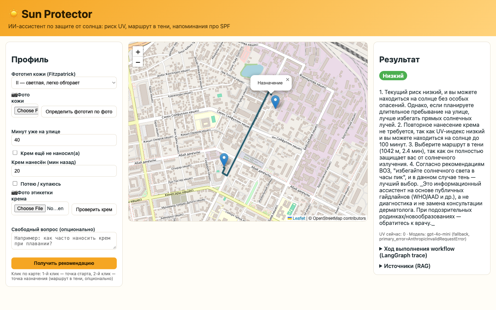
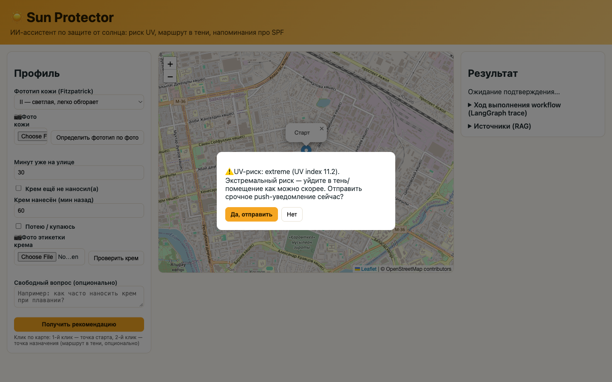

# ☀️ Sun Protector

ИИ-ассистент по безопасности на солнце: показывает текущий UV-риск для вашего
типа кожи, находит самый тенистый пеший маршрут до цели и напоминает, когда
обновить солнцезащитный крем — на основе публичных дерматологических
гайдлайнов (WHO, AAD, EPA, SkinCancer.org), а не диагностики.

Сделано как финальный проект курса (см. `final_task.md` / `my_project.md` —
исходное задание). Полное техническое обоснование — в [ARCHITECTURE.md](ARCHITECTURE.md);
методология и результаты evals — в [EVALS.md](EVALS.md).




## Что делает

- **Оценка риска**: фототип кожи по Фицпатрику + живой UV-индекс (Open-Meteo) →
  детерминированный риск-скор (low/moderate/high/very_high/extreme) и таймер
  повторного нанесения крема.
- **Маршрут с учётом тени**: для заданной точки назначения ранжирует
  альтернативные пешие маршруты по доле тени (роутинг OSRM + данные о зданиях
  OpenStreetMap + реальная позиция солнца — а не просто по кратчайшему
  расстоянию).
- **Фото → фототип**: загрузите фото кожи — получите оценку типа по
  Фицпатрику.
- **Фото → проверка этикетки**: загрузите фото этикетки крема — SPF и состав
  считываются через OCR и сверяются с рекомендациями гайдлайнов.
- **Вопросы по гайдлайнам**: свободный вопрос отвечается через RAG по
  реальному корпусу WHO/AAD/EPA/SkinCancer.org с указанием источников.
- **Подтверждение при срочном риске**: при очень высоком/экстремальном риске
  workflow останавливается и просит подтвердить отправку срочного
  уведомления (human-in-the-loop).

## Чек-лист требований курса

| Требование | Где |
|---|---|
| Многошаговый workflow LangGraph (ветвление, цикл, human-in-the-loop) | `agent-service/app/graph/` |
| MCP-сервер, 3 тула | `mcp-server/` |
| Skill (SKILL.md) | `skills/sunscreen-reapplication-advisor/SKILL.md` |
| RAG-пайплайн (chunking, эмбеддинги, векторная БД) | `agent-service/app/rag/` |
| Обработка документов/скрапинг сайтов для RAG-корпуса | `agent-service/data/corpus/` (собрано с WHO/AAD/EPA/SkinCancer.org) |
| Мультимодальность (vision) | `agent-service/app/multimodal/` |
| LangSmith-трейсинг | `agent-service/app/tracing.py` (задать `LANGCHAIN_API_KEY` в `.env`) |
| Golden dataset (30 примеров) + evals | `evals/golden_dataset.json`, `evals/run_evals.py`, [EVALS.md](EVALS.md) |
| A/B эксперимент | `evals/ab_test.py`, [EVALS.md](EVALS.md) |
| Обоснованный выбор LLM и гиперпараметров | [ARCHITECTURE.md](ARCHITECTURE.md) §3, `app/config.py` |
| Guardrails (бонус) | `agent-service/app/guardrails.py` |
| Fallback между моделями (бонус) | `app/config.py:call_with_fallback` — реально сработал, см. EVALS.md |
| Docker / docker-compose (бонус) | `Dockerfile`, `docker-compose.yml` |
| Веб-фронтенд | `frontend/` (статика, без сборки) |

## Запуск

### Вариант A — Docker (проще всего)

```bash
cp .env.example .env   # затем впишите CLAUDE_API_KEY / OPENAI_API_KEY
docker compose up --build
# только в первый раз, в другом терминале: загрузить RAG-корпус
docker compose exec sun-protector python -m app.rag.ingest
```

Открыть http://localhost:8000

### Вариант B — локально

Нужен Python 3.11+.

```bash
python3 -m venv .venv
source .venv/bin/activate
pip install -r agent-service/requirements.txt -r mcp-server/requirements.txt

cp .env.example .env   # затем впишите CLAUDE_API_KEY / OPENAI_API_KEY

cd agent-service
python -m app.rag.ingest        # один раз: заэмбеддить корпус гайдлайнов в Chroma
uvicorn app.main:app --reload --port 8000
```

Открыть http://localhost:8000 — один и тот же процесс FastAPI отдаёт и API, и
статический фронтенд. Разрешите доступ к геолокации, чтобы карта
центрировалась на вас, либо просто кликните в любую точку карты, чтобы
задать точку старта.

### Запуск evals / A/B-теста

```bash
cd evals
python run_evals.py     # -> results/results.json
python ab_test.py       # -> results/ab_test_results.json
```

### Использование MCP-сервера отдельно (например, из Claude Desktop)

```json
{
  "mcpServers": {
    "sun-protector": {
      "command": "python",
      "args": ["/absolute/path/to/mcp-server/server.py"]
    }
  }
}
```

## Ручная проверка, выполненная при сборке проекта

Каждый из пунктов ниже был реально прогнан через работающее приложение (не
только юнит-тестами) во время разработки: вызовы MCP-тулов по настоящему
stdio-протоколу (UV-прогноз, поиск аптек, маршрут в тени — все против живых
API Open-Meteo/OSRM/OpenStreetMap); полный LangGraph workflow, включая цикл
human-in-the-loop `interrupt()`/resume; RAG-retrieval с корректно
процитированными чанками гайдлайнов; автоматический fallback Claude→OpenAI
(сработал по-настоящему — у ключа Anthropic закончился баланс прямо во время
сборки, см. EVALS.md); guardrails, заблокировавшие попытку prompt injection;
и фронтенд целиком через настоящий браузер (рендер карты, построение
маршрута, диалог подтверждения) — скриншоты выше сделаны в той самой сессии,
а не нарисованы вручную.

## Известные ограничения

- Маршрутизация по тени — эвристика (позиция солнца + близость зданий), а не
  настоящий raycasting теней — см. `mcp-server/tools/shade_route.py`.
- Формула риска использует общепринятые дерматологические учебные ориентиры,
  а не клинически калиброванную персональную модель — информационно, не
  диагностически.
- Нет auth/ролей, нет CI-пайплайна, нет production-деплоя — вне рамок
  таймлайна курса (полный список в ARCHITECTURE.md §5, проговорено честно, а
  не спрятано).
- **Замечание по безопасности**: в `.env` этого репозитория в какой-то момент
  оказался живой API-ключ, вставленный прямо в чат-сессию; этот ключ следует
  считать скомпрометированным и заменить перед любым реальным использованием.
  `.env` добавлен в gitignore.

## Структура репозитория

```
agent-service/   FastAPI-приложение, LangGraph workflow, RAG, мультимодальность, конфиг
mcp-server/      Отдельный MCP-сервер (3 тула)
skills/          Claude Skill (SKILL.md)
frontend/        Статический веб-интерфейс (без сборки)
evals/           Golden dataset, eval runner, A/B-тест
docs/            Скриншоты
ARCHITECTURE.md  Обоснование архитектуры, диаграмма потока запроса, trade-off'ы
EVALS.md         Метрики, обоснование golden dataset, результаты A/B
```
